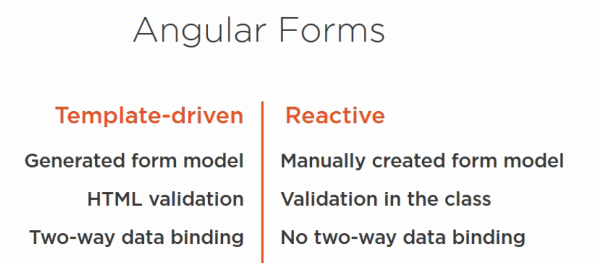

# Angular Forms


## What is angular form

Applications use forms to enable users to log in, to update a profile, to enter sensitive information, and to perform many other data-entry tasks.

Angular provides two different approaches to handle **user input** through **forms**: 
* Template-driven Forms
* Reactive Forms

We will use **template-driven** form.

Here is how both forms works in a nutshell:




## **About this exercise**
Previously we had an **API** and **frontend angular application**. We performed data seeding for our API so that we can show that data in our frontend application from the database:

**Backend Codebase**\
Previously we had an API in which we did

* EF Code first approach to generate database of a fictitious bank application called **BBBank**.
* Applied data seeding to the database.

For more details see [data seeding](https://github.com/PatternsTechGit/PT_AzureSql_EFDataSeeding) lab.

**Frontend Codebase**\
Previously we had frontend angular application in which we have

* FontAwesome library for icons.
* Bootstrap library for styling.
* Created client side models to receive data
* Created transaction service to call the API
* Fixed the CORS error on the server side
* Populated html table, using data returned by API

For more details see [Angular calling API](https://github.com/PatternsTechGit/PT_AngularCallingAPI) lab.


## **In this exercise**

In this exercise again we will be working on two codebase i.e. **Backend Codebase** and **Frontend Codebase**.

**Backend Codebase**

#### On backend side we would:
* Do necessary model changes and execute migration commands
* Create an **account controller** with method `OpenAccount`
* Create an **account service** and a contract for this service in the **Service** project 
* Register the **service in asp.net core middleware** as scoped


**Frontend Codebase**
#### On frontend side we would:
* Create **template driven form** 
* Perform **input fields validation**  
* Create client side **models** to map data for API
* Create the **account service** to call the API


## Backend Implementation

Follow the below steps to implement backend code changes:

## Step 1: User and Account model changes

We will make some user model properties nullable so that if these are not provided from frontend then we should not be getting errors thrown by database so user model would be looks like this. Consider the question mark (?) in front of properties that needs to be nullable . 

```cs
    public class User : BaseEntity // Inheriting from Base Entity class
    {
        // First name
        public string? FirstName { get; set; }

        // Last name
        public string? LastName { get; set; }

        // Email of the user
        public string Email { get; set; }

        // Profile picture or avatar
        public string? ProfilePicUrl { get; set; }

        // Account attached to the user 
        public virtual Account Account { get; set; }
    }

```

And account model would looks like below, see the `AccountStatus` decorated with `[JsonConverter(typeof(JsonStringEnumConverter))]` so that it can map frontend values to account status enum.

```cs
    public class Account : BaseEntity // Inheriting from Base Entity class
    {
        // String that uniquely identifies the account
        public string AccountNumber { get; set; }

        //Title of teh account
        public string AccountTitle { get; set; }

        //Available Balance of the account
        public decimal CurrentBalance { get; set; }

        // This decoration is required to conver integer coming in from UI to respective Enum
        [JsonConverter(typeof(JsonStringEnumConverter))]
        //Account's status
        public AccountStatus AccountStatus { get; set; }

        //Setting forignkey to resolve circular dependency
        [ForeignKey("UserId")]
        public string UserId { get; set; }

        // One User might have 1 or more Accounts (1:Many relationship) 
        public virtual User User { get; set; }

        // One Account might have 0 or more Transactions (1:Many relationship)
        public virtual ICollection<Transaction> Transactions { get; set; }
    }

    // Two posible statuses of an account
    public enum AccountStatus
    {
        Active = 1,     // When an account can perform transactions
        InActive = 0    // When an account cannot perform transaction
    }
```

## Step 2 Data migration
In step 1 we did some changes in `User` model, now we need to execute data migration commands so that changes can be reflected in database as well.

Execute following commands one by one:

>Add-Migration FormsLab

>Update-Database

## Step 3: Creating Interface for Account Service

In **Services** project create an interface (contract) in **Contracts** folder to implement the separation of concerns.
It will make our code testable and injectable as a dependency.

```csharp
public interface IAccountsService
{
    Task OpenAccount(Account account);
}
```

## Step 4: Implementing Account Service 

In **Services** project we will be implementing account service. Create new file **AccountService.cs**

In this file we will be implementing **IAccountsService** interface, below code would be used\
In `OpenAccount` method first we are checking if user does not exists then create new user otherwise update existing user.

```csharp
public class AccountService : IAccountsService
{
    private readonly BBBankContext _bbBankContext;
    public AccountService(BBBankContext BBBankContext)
    {
        _bbBankContext = BBBankContext;
    }
    public async Task OpenAccount(Account account)
    {
        // Setting up ID of new incoming Account to be created.
        account.Id = Guid.NewGuid().ToString();
        // If the user with the same User ID is already in teh system we simply set the userId forign Key of Account with it else 
        // first we create that user and then use it's ID.
        var user = await _bbBankContext.Users.FirstOrDefaultAsync(x=>x.Id == account.User.Id);
        if (user == null)
        {
            await _bbBankContext.Users.AddAsync(account.User);
            account.UserId = account.User.Id;
        }
        else
        {
            account.UserId = user.Id;
        }
        // Once User ID forigen key and Account ID Primary Key is set we add the new accoun in Accounts.
        await this._bbBankContext.Accounts.AddAsync(account);
        // Once everything in place we make the Database call.
        await this._bbBankContext.SaveChangesAsync();
    }
}
```

## Step 5: Register Account and Database Context Service

In `Program.cs` file we will add **BBBankContext** and **IAccountsService** to services container.

```csharp
builder.Services.AddScoped<IAccountsService, AccountService>();
builder.Services.AddScoped<DbContext, BBBankContext>();
```

## Step 6: Creating Open Account API Method

Create a new API controller named `AccountsController` and inject the `IAccountsService` using the constructor.

```csharp
private readonly IAccountsService _accountsService;
public AccountsController(IAccountsService accountsService)
{
    _accountsService = accountsService;
}
```

Now we will create an API method **OpenAccount** in `AccountsController` to call the service so that new account can be created.

```csharp
[HttpPost]
[Route("OpenAccount")]
public async Task<ActionResult> OpenAccount(Account account)
{
    try
    {
        await _accountsService.OpenAccount(account);
        return new OkObjectResult("New Account Created.");
    }
    catch (Exception ex)
    {
        return new BadRequestObjectResult(ex);
    }
}
```

## Step 7: Disable ASP.NET Core model validation 

We need to disable ASP.NET Core model validation so that we does not get model validation errors as non-nullable `Account` model properties would be expecting values. So add following code in `program.cs`

```cs
builder.Services.Configure<ApiBehaviorOptions>(options =>
{
    options.SuppressModelStateInvalidFilter = true;
});
```
Now backend is ready and would be proceeding to implement frontend.

## Frontend Implementation

Follow the below steps to implement frontend code changes:

## Step 1: Component Styling
Copy following CSS in existing `app.component.css` for angular form styling

```css
.card {
  position: relative;
  display: flex;
  flex-direction: column;
  min-width: 0;
  word-wrap: break-word;
  background-color: #ffffff;
  background-clip: border-box;
  border: 0.0625rem solid rgba(34, 42, 66, 0.05);
  border-radius: 0.2857rem;
}
.card {
  background: #27293d;
  border: 0;
  position: relative;
  width: 100%;
  margin-bottom: 30px;
  box-shadow: 0 1px 20px 0px rgba(0, 0, 0, 0.1);
}
.card .card-body {
  padding: 15px;
}
.card .card-body .card-description {
  color: rgba(255, 255, 255, 0.6);
}
.card .avatar {
  width: 30px;
  height: 30px;
  overflow: hidden;
  border-radius: 50%;
  margin-bottom: 15px;
}
.card-user {
  overflow: hidden;
}
.card-user .author {
  text-align: center;
  text-transform: none;
  margin-top: 25px;
}
.card-user .author a+p.description {
  margin-top: -7px;
}
.card-user .author .block {
  position: absolute;
  height: 100px;
  width: 250px;
}
.card-user .author .block.block-one {
  background: rgba(225, 78, 202, 0.6);
  background: -webkit-linear-gradient(to right, rgba(225, 78, 202, 0.6) 0%, rgba(225, 78, 202, 0) 100%);
  background: -o-linear-gradient(to right, rgba(225, 78, 202, 0.6) 0%, rgba(225, 78, 202, 0) 100%);
  background: -moz-linear-gradient(to right, rgba(225, 78, 202, 0.6) 0%, rgba(225, 78, 202, 0) 100%);
  background: linear-gradient(to right, rgba(225, 78, 202, 0.6) 0%, rgba(225, 78, 202, 0) 100%);
  filter: progid:DXImageTransform.Microsoft.BasicImage(rotation=10);
  -webkit-transform: rotate(150deg);
  -moz-transform: rotate(150deg);
  -ms-transform: rotate(150deg);
  -o-transform: rotate(150deg);
  transform: rotate(150deg);
  margin-top: -90px;
  margin-left: -50px;
}
.card-user .author .block.block-two {
  background: rgba(225, 78, 202, 0.6);
  background: -webkit-linear-gradient(to right, rgba(225, 78, 202, 0.6) 0%, rgba(225, 78, 202, 0) 100%);
  background: -o-linear-gradient(to right, rgba(225, 78, 202, 0.6) 0%, rgba(225, 78, 202, 0) 100%);
  background: -moz-linear-gradient(to right, rgba(225, 78, 202, 0.6) 0%, rgba(225, 78, 202, 0) 100%);
  background: linear-gradient(to right, rgba(225, 78, 202, 0.6) 0%, rgba(225, 78, 202, 0) 100%);
  filter: progid:DXImageTransform.Microsoft.BasicImage(rotation=10);
  -webkit-transform: rotate(30deg);
  -moz-transform: rotate(30deg);
  -ms-transform: rotate(30deg);
  -o-transform: rotate(30deg);
  transform: rotate(30deg);
  margin-top: -40px;
  margin-left: -100px;
}
.card-user .author .block.block-three {
  background: rgba(225, 78, 202, 0.6);
  background: -webkit-linear-gradient(to right, rgba(225, 78, 202, 0.6) 0%, rgba(225, 78, 202, 0) 100%);
  background: -o-linear-gradient(to right, rgba(225, 78, 202, 0.6) 0%, rgba(225, 78, 202, 0) 100%);
  background: -moz-linear-gradient(to right, rgba(225, 78, 202, 0.6) 0%, rgba(225, 78, 202, 0) 100%);
  background: linear-gradient(to right, rgba(225, 78, 202, 0.6) 0%, rgba(225, 78, 202, 0) 100%);
  filter: progid:DXImageTransform.Microsoft.BasicImage(rotation=10);
  -webkit-transform: rotate(170deg);
  -moz-transform: rotate(170deg);
  -ms-transform: rotate(170deg);
  -o-transform: rotate(170deg);
  transform: rotate(170deg);
  margin-top: -70px;
  right: -45px;
}
.card-user .author .block.block-four {
  background: rgba(225, 78, 202, 0.6);
  background: -webkit-linear-gradient(to right, rgba(225, 78, 202, 0.6) 0%, rgba(225, 78, 202, 0) 100%);
  background: -o-linear-gradient(to right, rgba(225, 78, 202, 0.6) 0%, rgba(225, 78, 202, 0) 100%);
  background: -moz-linear-gradient(to right, rgba(225, 78, 202, 0.6) 0%, rgba(225, 78, 202, 0) 100%);
  background: linear-gradient(to right, rgba(225, 78, 202, 0.6) 0%, rgba(225, 78, 202, 0) 100%);
  filter: progid:DXImageTransform.Microsoft.BasicImage(rotation=10);
  -webkit-transform: rotate(150deg);
  -moz-transform: rotate(150deg);
  -ms-transform: rotate(150deg);
  -o-transform: rotate(150deg);
  transform: rotate(150deg);
  margin-top: -25px;
  right: -45px;
}
.card-user .avatar {
  width: 124px;
  height: 124px;
  border: 5px solid #2b3553;
  border-bottom-color: transparent;
  background-color: transparent;
  position: relative;
}
.card-user .card-body {
  min-height: 240px;
}
.card-user .card-description {
  margin-top: 30px;
}
.card .amount-cont {
  color: rgba(255, 255, 255, 0.6);
  font-size: .875rem;
  font-weight: 300;
}
.form-control {
  background-color: #27293d;
  font-size: 1.125rem;
  font-weight: 300;
  color: #fff;
  border: 1px solid #e14eca;
  margin-bottom: 1rem;
}
.input-group-text {
  font-size: 1.125rem;
  font-weight: 400;
  line-height: 1.5;
  color: #fff;
  background-color: #27293d;
  border: 1px solid #e14eca;
  margin-bottom: 1rem;
}
.error-message {
  text-align: center;
}
.text-warning {
  color: #ff8d72 !important;
  font-size: .875rem;
  font-weight: 300;
  margin-bottom: 1px;
}
.avatar-cont {
  position: relative;
  width: 124px;
  height: 124px;
  margin: 0 auto;
  margin-bottom: 1px;
}
a.btn-change-avatar {
  display: block;
  width: 40px;
  height: 40px;
  border-radius: 5px;
  color: #fff;
  background: #e14eca;
  font-size: 1.25rem;
  line-height: 40px;
  position: absolute;
  bottom: 0;
  right: 0;
  transition: all .3s ease 0s;
}
a.btn-change-avatar:hover, a.btn-change-avatar:focus, a.btn-change-avatar:active {
  background: #b940a6;
  transition: all .3s ease 0s;
}

/* START Active Inactive swith segment control */
.segmented-control {
  position: relative;
  display: block;
  width: 220px;
  border: 1px solid #e14eca;
  font-style: normal;
  font-weight: normal;
  text-decoration: none;
  overflow: hidden;
  -moz-border-radius: 2px;
  -webkit-border-radius: 2px;
  border-radius: 2px;
  -moz-box-sizing: border-box;
  -webkit-box-sizing: border-box;
  box-sizing: border-box;
  -moz-user-select: -moz-none;
  -ms-user-select: none;
  -webkit-user-select: none;
  user-select: none;
  -moz-transition-duration: 0.7s;
  -o-transition-duration: 0.7s;
  -webkit-transition-duration: 0.7s;
  transition-duration: 0.7s;
  -moz-transition-timing-function: cubic-bezier(0.445, 0.05, 0.55, 0.95);
  -o-transition-timing-function: cubic-bezier(0.445, 0.05, 0.55, 0.95);
  -webkit-transition-timing-function: cubic-bezier(0.445, 0.05, 0.55, 0.95);
  transition-timing-function: cubic-bezier(0.445, 0.05, 0.55, 0.95);
  -moz-transition-property: none;
  -o-transition-property: none;
  -webkit-transition-property: none;
  transition-property: none;
  -webkit-tap-highlight-color: transparent; 
}
.segmented-control > input {
  position: absolute;
  left: -10000px;
  opacity: 0;
}
.segmented-control > input[type='checkbox'] ~ label {
  -moz-transition-duration: 0s;
  -o-transition-duration: 0s;
  -webkit-transition-duration: 0s;
  transition-duration: 0s;
}
.segmented-control > input[type='checkbox'] ~ label:before {
  opacity: 0;
}
.segmented-control > input:disabled:nth-child(1) ~ label:nth-of-type(1) {
  opacity: 0.3;
  cursor: not-allowed;
}
.segmented-control > input:nth-child(1):checked ~ label:nth-of-type(1):after, .segmented-control > input:nth-child(1):checked ~ label:nth-of-type(1):before {
  opacity: 1;
}
.segmented-control > input:nth-child(1):checked ~ label:first-of-type:nth-last-of-type(1):after, .segmented-control > input:nth-child(1):checked ~ label:first-of-type:nth-last-of-type(1):before, .segmented-control > input:nth-child(1):checked ~ label:first-of-type:nth-last-of-type(1) ~ label:after, .segmented-control > input:nth-child(1):checked ~ label:first-of-type:nth-last-of-type(1) ~ label:before {
  -moz-transform: translateX(0%);
  -ms-transform: translateX(0%);
  -webkit-transform: translateX(0%);
  transform: translateX(0%);
}
.segmented-control > input:nth-child(1):checked ~ label:first-of-type:nth-last-of-type(2):after, .segmented-control > input:nth-child(1):checked ~ label:first-of-type:nth-last-of-type(2):before, .segmented-control > input:nth-child(1):checked ~ label:first-of-type:nth-last-of-type(2) ~ label:after, .segmented-control > input:nth-child(1):checked ~ label:first-of-type:nth-last-of-type(2) ~ label:before {
  -moz-transform: translateX(0%);
  -ms-transform: translateX(0%);
  -webkit-transform: translateX(0%);
  transform: translateX(0%);
}
.segmented-control > input:disabled:nth-child(2) ~ label:nth-of-type(2) {
  opacity: 0.3;
  cursor: not-allowed;
}
.segmented-control > input:nth-child(2):checked ~ label:nth-of-type(2):after, .segmented-control > input:nth-child(2):checked ~ label:nth-of-type(2):before {
  opacity: 1;
}
.segmented-control > input:nth-child(2):checked ~ label:first-of-type:nth-last-of-type(2):after, .segmented-control > input:nth-child(2):checked ~ label:first-of-type:nth-last-of-type(2):before, .segmented-control > input:nth-child(2):checked ~ label:first-of-type:nth-last-of-type(2) ~ label:after, .segmented-control > input:nth-child(2):checked ~ label:first-of-type:nth-last-of-type(2) ~ label:before {
  -moz-transform: translateX(100%);
  -ms-transform: translateX(100%);
  -webkit-transform: translateX(100%);
  transform: translateX(100%);
}
.segmented-control > label {
  display: inline-block;
  padding: 0 .71em;
  cursor: pointer;
  float: left;
  line-height: 2.4375rem;      
  font-size: 1.15rem;
  font-weight: 300;
  text-decoration: inherit;
  -moz-transition-property: none;
  -o-transition-property: none;
  -webkit-transition-property: none;
  transition-property: none;
  -moz-transition-duration: inherit;
  -o-transition-duration: inherit;
  -webkit-transition-duration: inherit;
  transition-duration: inherit;
  -moz-transition-timing-function: inherit;
  -o-transition-timing-function: inherit;
  -webkit-transition-timing-function: inherit;
  transition-timing-function: inherit;
}
.segmented-control > label:before, .segmented-control > label:after {
  position: absolute;
  left: 0;
  top: 0;
  width: 100%;
  height: 100%;
  pointer-events: none;
  -moz-transform: translateX(-100%);
  -ms-transform: translateX(-100%);
  -webkit-transform: translateX(-100%);
  transform: translateX(-100%);
}
.segmented-control > label:after {
  color: white;
  content: attr(data-value);
  text-align: center;
  padding: inherit;
  z-index: 10;
  font-style: inherit;
  text-decoration: inherit;
  font-weight: inherit;
  opacity: 0;
  -moz-transition-property: opacity, -moz-transform;
  -o-transition-property: opacity, -o-transform;
  -webkit-transition-property: opacity, -webkit-transform;
  transition-property: opacity, transform;
  -moz-transition-duration: inherit;
  -o-transition-duration: inherit;
  -webkit-transition-duration: inherit;
  transition-duration: inherit;
  -moz-transition-timing-function: inherit;
  -o-transition-timing-function: inherit;
  -webkit-transition-timing-function: inherit;
  transition-timing-function: inherit;
}
.segmented-control > label:after, .segmented-control > label {
  text-align: center;
  text-overflow: ellipsis;
  white-space: nowrap;
  overflow: hidden;
  -moz-box-sizing: border-box;
  -webkit-box-sizing: border-box;
  box-sizing: border-box;
}
.segmented-control > label:before {
  content: '';
  color: inherit;
  background: #e14eca;
  -moz-transition-property: -moz-transform;
  -o-transition-property: -o-transform;
  -webkit-transition-property: -webkit-transform;
  transition-property: transform;
  -moz-transition-duration: inherit;
  -o-transition-duration: inherit;
  -webkit-transition-duration: inherit;
  transition-duration: inherit;
  -moz-transition-timing-function: inherit;
  -o-transition-timing-function: inherit;
  -webkit-transition-timing-function: inherit;
  transition-timing-function: inherit;
}
.segmented-control > label:first-of-type:nth-last-of-type(2), .segmented-control > label:first-of-type:nth-last-of-type(2):after, .segmented-control > label:first-of-type:nth-last-of-type(2):before, .segmented-control > label:first-of-type:nth-last-of-type(2) ~ label, .segmented-control > label:first-of-type:nth-last-of-type(2) ~ label:after, .segmented-control > label:first-of-type:nth-last-of-type(2) ~ label:before {
  width: 50%;
  margin-bottom: 0;
}
/* END Active Inactive swith segment control */
.btn-cancel{
  float: right;
  width: 300px;
  background-color: darkgray;
}
.btn-create{
  width: 300px;
}
```
## Step 2: Create model classes

Create a new file `account.ts` in **models** folder which will contain the `Account` class representing *account* model and  `User` class representing *User* model. Account model would be used to map with backend account model so that we can pass frontend model to API method as parameter.

```ts
export class Account {
  accountTitle: string;
  user: User;
  currentBalance: number;
  accountStatus: number;
  accountNumber: string;
}
export class User {
  id: string;
  profilePicUrl: string;
  email: string;
  phoneNumber: string;
  firstName: string;
  lastName: string;
}
```
Create another file `azuread.service.ts` which will contain the `AzureAdUser` model to map azure active directory users
```ts
export interface AzureAdUser {
    id: string;
    surname: string;
    givenName: string;
    mail: string
    displayName: string;
}
```
## Step 3: Setup Account Service.
Create a new file `accounts.service.ts` in **services** folder which will contain the `openAccount` method which will call the API method to save the account information as below :

```ts
export default class AccountsService {
  constructor(private httpClient: HttpClient) { }

openAccount(account: Account): Observable<ApiResponse> {
    const headers = {
      headers: new HttpHeaders({
        'Content-Type': 'application/json'
      })
    }
    console.log(account);
    return this.httpClient.post<ApiResponse>(`${environment.apiUrlBase}Accounts/OpenAccount`, JSON.stringify(account), headers);
  }
}
```

## Step 4: Setup Azure Active Directory Service.
Create a new file `azuread.service.ts` in **services** folder which will contain the `getAzureAdUsersList` method which will call the azure logic app to get the users list
```ts
export default class AzureAdService {
  constructor(private httpClient: HttpClient) { }

  // Azure logic app is already set to receive an empty POST request that does the magic of fetching the access token and returning list of AD users 
  getAzureAdUsersList(): Observable<AzureAdUser[]> {
    return this.httpClient.post<AzureAdUser[]>(environment.azureAdUsersListUrl, {
      "client_secret" : environment.client_secret,
      "client_id" : environment.ApiclientId,
      "tenantid" : environment.tenantid
    });
  }

}
```
## Step 5: Angular Form Code

Add code in `app.component.ts`. It contains following methods:\
`onAdUserSelect` which will be binding azure directory users to the dropdown\
`onSubmit` which will be used to call the account service\
`initializeEmptyForm` to empty the form after `onSubmit` successful call

```ts
export class AppComponent {

  @ViewChild('photo') photo: ElementRef;
  // Entire form and its controls are two way binded to this property.
  // This is the property when populated will be send back to server.
  public account: Account;
  // Array used to populate AD Users drop down.
  azureAdUsers: AzureAdUser[];
  // Selected user on drop down.
  selectedAdUser: AzureAdUser;
  constructor(private azureAdService: AzureAdService, private accountsService: AccountsService) {
    this.initializeEmptyForm();
  }
  onAdUserSelect() {
    // few of the  properties of account object will be populated from the properties of Azure AD User
    this.account.user.id = this.selectedAdUser.id
    this.account.user.firstName = this.selectedAdUser.givenName;
    this.account.user.lastName = this.selectedAdUser.surname;
    this.account.user.email = this.selectedAdUser.mail;
    /*     this.azureAdService
        .getAzureAdUsersPic(this.selectedAdUser.id)
        .subscribe({
          next: (data) => {
            console.log(data);
            this.photo['src'] = data['value'];
          },
          error: (error) => {
            console.log(error);
          },
        }); */
  }
  onSubmit() {
    console.log(this.account);
    this.accountsService
    // sending the two way binded and populated account object to the server to get persisted.
      .openAccount(this.account)
      .subscribe({
        next: (data) => {
          // clearing up the form again after form data is sent to server.
          this.initializeEmptyForm();
        },
        error: (error) => {
          console.log(error);
        },
      });
  }
  initializeEmptyForm() {
    // fetching list of Azure AD Users from azureAdService
    this.azureAdService
      .getAzureAdUsersList()
      .subscribe({
        next: (data) => {
          //console.log(data['value']);
          this.azureAdUsers = data['value'];
        },
        error: (error) => {
          console.log(error);
        },
      });
      // Setting up empty or default controls.
    //this.selectedAdUser = null;
    this.account = new Account();
    this.account.accountStatus = 1;
    this.account.user = new User();
    this.account.user.profilePicUrl = '../../assets/images/No-Image.png';
  }
}

```
## Step 6: Angular Form HTML
Add code in `app.component.html`. First control is a dropdown that is bind to azure active directory users through `onAdUserSelect` method of `app.component.ts` class. Other input fields of account are bind as two way binding to `account` model.\
Input fields also have [built-in](https://angular.io/api/forms/Validators) angular validators applied, some of are:
* required
* minlength
* maxlength 

If any input control is in error state then angular form would also be in error state.
```ts
<form class="example-container" (ngSubmit)="onSubmit()" #accountForm="ngForm" novalidate>
  <div class="row">
    <div class="col-12">
      <div class="card card-user">
        <div class="card-body">
          <div class="author">
            <div class="block block-one"></div>
            <div class="block block-two"></div>
            <div class="block block-three"></div>
            <div class="block block-four"></div>
            <!-- all the elements in the form are two way bind to a property called account of type Account.  -->
            <div class="avatar-cont">
              
              <a href="javascript:void(0)" class="btn-change-avatar"><i class="fas fa-camera"></i></a>
            </div>

          </div>
          <div class="row mt-3">
            <!-- Custom Validator https://www.digitalocean.com/community/tutorials/angular-custom-validation -->
            <div class="col-sm-12 ml-auto mr-auto">
              <div class="amount-cont">
                <div class="form-row row">
                  <!-- currently selected active directory user will be in selectedAdUser -->
                  <!-- on Select's selection change "onAdUserSelect" function will be called -->
                  <select class="form-control" name="user" id="user" [(ngModel)]="selectedAdUser"
                    (change)="onAdUserSelect()">
                    <option [ngValue]="null" selected disabled>Select Azure AD User</option>
                    <!-- All AD Users fetched from the server are in array of type azureAdUser called azureAdUsers  -->
                    <!-- looping on that array to populate Select control and setting the individual value to adUser and picking up displayName from it for display -->
                    <option *ngFor="let adUser of azureAdUsers" [ngValue]="adUser">{{adUser?.displayName}}</option>
                  </select>
                </div>
                <div class="form-row row">
                  <div class="col-6">
                    <div class="my-1">
                      <label for="accountTitle">Account Title</label>
                      <!-- #accountTitle gives unique name of this control that is later referenced in validation. -->
                      <!-- this control has required, maxlength, and minlength validators. -->
                      <!-- and this control is two way binded to  account.accountTitle property -->
                      <input #accountTitle="ngModel" type="text" class="form-control" id="accountTitle"
                        placeholder="Account Title" [(ngModel)]="account.accountTitle" name="accountTitle" required
                        minlength="4" maxlength="30" />
                    </div>
                    <div class="my-1">
                      <label for="accountNumber">Account Number</label>
                      <input #accountNumber="ngModel" type="text" class="form-control" id="accountNumber"
                        placeholder="Account Number" [(ngModel)]="account.accountNumber" name="accountNumber"
                        required />
                    </div>
                    <div class="my-1">
                      <label for="openingBalance">Opening Balance</label>
                      <div class="input-group mb-2">
                        <div class="input-group-prepend">
                          <div class="input-group-text">$</div>
                        </div>
                        <input type="number" class="form-control" id="currentBalance" placeholder="Current Balance"
                          [(ngModel)]="account.currentBalance" name="currentBalance"
                          onKeyPress="if(this.value.length==10) return false;" />
                      </div>
                    </div>
                  </div>
                  <div class="col-6">
                    <div class="my-1">
                      <label for="phoneNumber">Phone Number</label>
                      <input type="tel" class="form-control" id="phoneNumber" placeholder="Phone Number"
                        [(ngModel)]="account.user.phoneNumber" name="phoneNumber"
                        onKeyPress="if(this.value.length==10) return false;" />
                    </div>
                    <div class="my-1">
                      <label for="email">Email</label>
                      <!-- special case where we are validating this text box using an Email Reg Ex along with other built in validators. -->
                      <input type="email" class="form-control" placeholder="Email" [(ngModel)]="account.user.email"
                        id="email" name="email" #email="ngModel" required minlength="6"
                        pattern="^\w+([\.-]?\w+)*@\w+([\.-]?\w+)*(\.\w{2,3})+$" />
                    </div>
                    <div class="my-1">
                      <label for="accountStatus">Account Status</label>

                      <!-- two radio buttons with same name bind to same model but different ids and different values make it work in a group  -->
                      <div class="segmented-control">
                        <input type="radio" name="accountStatus" id="accountStatus-1" value="Active"
                          [(ngModel)]="account.accountStatus" />
                        <input type="radio" name="accountStatus" id="accountStatus-2" value="InActive"
                          [(ngModel)]="account.accountStatus" />

                        <label for="accountStatus-1" data-value="Active">Active</label>
                        <label for="accountStatus-2" data-value="InActive">Inactive</label>
                      </div>
                    </div>
                  </div>
                </div>
              </div>
            </div>
          </div>
        </div>
      </div>
    </div>
  </div>
  <div class="row">
    <div class="col-12">
      <!-- This block/set of error texts will only appear if accountTitle has any errors and accountTitle is touched ot dirty -->
      <div class="error-message" *ngIf="
          accountTitle.errors && (accountTitle.dirty || accountTitle.touched)
        ">
        <!-- with the set of error messages this particular error will only be shown if "required" validation is failed.  -->
        <p class="text-warning" [hidden]="!accountTitle.errors?.['required']">
          <b>Warning:</b> That Account Title is required.
        </p>
        <p class="text-warning" [hidden]="!accountTitle.errors?.['minlength']">
          <b>Warning:</b> Account Title must be greater than 3 characters.
        </p>
      </div>
      <!-- similar concept is applied on other validation messages -->
      <div class="error-message" *ngIf="email.errors && (email.dirty || email.touched)">
        <p class="text-warning" [hidden]="!email.errors?.['required']">
          <b>Warning:</b> That Email is required.
        </p>
        <p class="text-warning" [hidden]="!email.errors?.['pattern']">
          <b>Warning:</b> Email is not in correct format.
        </p>
        <p class="text-warning" [hidden]="!email.errors?.['minlength']">
          <b>Warning:</b> Email must be greater than 6 characters.
        </p>
      </div>
      <div class="error-message" *ngIf="accountNumber.errors && (accountNumber.dirty || accountNumber.touched)">
        <p class="text-warning" [hidden]="!accountNumber.errors?.['required']">
          <b>Warning:</b> Account Number is required.
        </p>
      </div>
      <div class="row">
        <div>
          <div class="row">
            <div class="col-6 mb-3">
              <button class="btn btn-cancel btn-block" type="button">Cancel</button>
            </div>
            <div class="col-6">
              <!-- like we can track validation of individual forms we can also track validation of entire form -->
              <!-- Create buttons caus the form to trigger submit behavior but is disabled until entire form is in valid sate. -->
              <button [disabled]="!accountForm.form.valid" class="btn btn-danger btn-create btn-block" type="submit">
                Create
              </button>
            </div>
          </div>
        </div>
      </div>
    </div>
  </div>
</form>
```
------
### Final Output:

Now run the API so that it can receive angular form data then start angular application, it would looks like as below. Now enter data in input fields and you will see **Create** button would be enabled if there are no error appears then press **Create** button and you should be able to see new record is inserted in database accounts table if account does not exists. 

>
